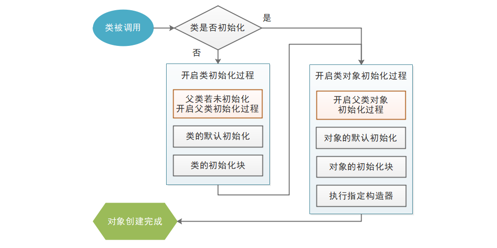
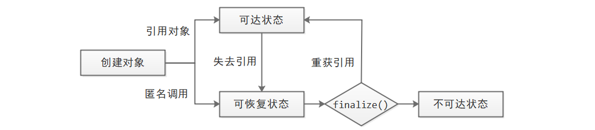
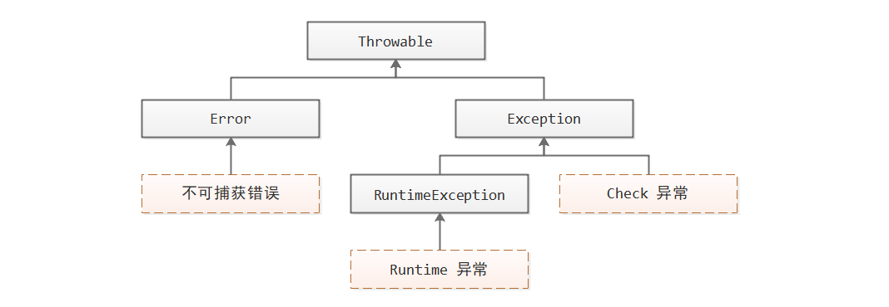
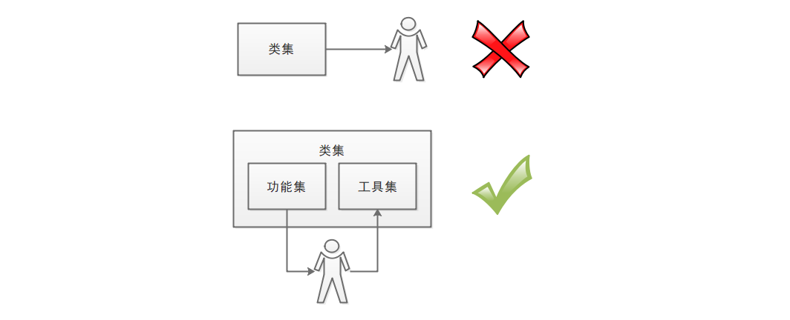
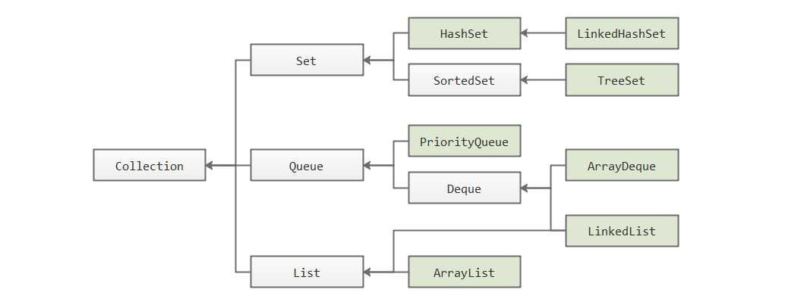
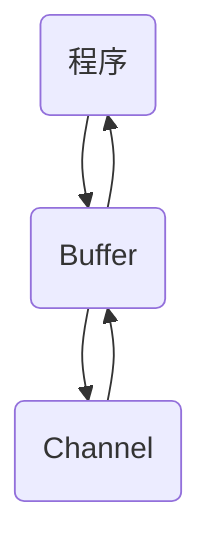

# Java Learning

<center>作者：5unnyroom1</center>
## 初识Java 

### 一次编译，到处运行

Java 是一种编译解释型语言，先编译，后解释。

> 编译型：将源代码编译成平台识别的机器码，然后在该平台独立运行，运行效率高。
>
> 解释型：使用平台相关的解释器对源代码逐行解释成机器码，并立即执行，平台移植性好。
>
> Java 则是在保证移植性的前提下，做出尽可能的优化用于提高运行效率，所以同时需要编译和解释。


> **字节码的执行基础 JRE**
>
> - Java 核心类库：包含了 Java 语言的核心特性
> - JVM ：所有平台的 JVM 向上提供相同的编程接口，从而可以识别平台无关的字节码，向下则适应不同平台的执行环境。
> - 其他环境支持文件（类加载器、字节码校验器...）

### Hello World

```java
public class HelloWorld {
    public static void main(String[] args) { //Java程序执行的入口
        System.out.println("Hello World!");
    }
}
```

### javac 命令

```bash
javac HelloWorld.java
# javac [options] <source files>
#     -cp xxx:xxx 设置Java类的搜索路径
#     -d xxx 设置字节码文件的存放路径
#     -Jxxx 向java启动器传递参数
```

### java 命令

```bash
java HelloWorld
# java [options] <class name> [args...]  !!必须包含main方法
#     -cp xxx:xxx
#     -Dxxx=xxx 设置系统参数
```

### jar 命令

> JAR 文件是一种 Java 代码资源归档文件，以 ZIP 格式构建，默认包含 META-INF/MANIFEST.MF 清单文件。如果添加到类搜索路径中，会被当成一个路径，搜索类文件。

jar 命令用于创建和维护 JAR 文件。

```bash
# jar 命令示例
# 创建 jar包
jar -c -v -f /path/to/jarfile/jarname.jar -e MainClassName -C /path/to/classes
# 查看 jar包
jar -t -v -f /path/to/jarfile/jarname.jar
# 解压 jar包
jar -x -v -f /path/to/jarfile/jarname.jar
```

> 设置Java命令行的显示语言：添加环境变量`JAVA_TOOL_OPTIONS` = `-Duser.language=en`

## Java 基础语法

### 注释

```java
单行注释
// xxx
多行注释
/*
xxx
xxx
*/
文档注释
/**
 * xxx
 * xxx
 */
```

> **文档注释**
>
> javadoc 命令用于生成 API 文档，它会自动识别源代码元素之前的文档注释。
>
> ```bash
> # javadoc [options] <source files>
> #     -d API文档存放路径
> ```
>
> 以@开头东东被称之为Javadoc文档标记，是JDK定义好的，如@author、@version、@since、@see、@link、@code、@param、@return、@exception、@throws等。

### 变量

Java 语言是一门强类型语言。

- 所有的变量必须先声明类型，后使用
- 指定类型的变量只能接受匹配的类型值
- 变量名需要满足的条件：
  - 由字母、数字、下划线`_`、美元符`$`组成
  - 不能以数字开头
  - 不能直接使用`_`作为变量名
  - 不能与 Java 关键字同名
- 被 final 修饰的变量只能被赋值一次

```java
type varName[ = initValue];
```

Java 的数据类型分为两种：

| 数据类型 | 种类                                                 | 访问方式     |
| -------- | ---------------------------------------------------- | ------------ |
| 基本类型 | byte、short、int、long、char、float、double、boolean | 直接访问     |
| 引用类型 | 数组、类                                             | 通过指针访问 |

#### 整型

| 类型名称 | 占用位数 | 表示范围                       |
| -------- | -------- | ------------------------------ |
| byte     | 8 bits   | -128 ~ 127                     |
| short    | 16 bits  | -32,768 ~ 32,767               |
| int      | 32 bits  | -2,147,483,648 ~ 2,147,483,647 |
| long     | 64 bits  | -9.22e18 ~ 9.22e18             |

> **整型直接量表示法**
>
> - 十进制 `nnn`
>
> - 二进制 `0Bnnn`
>
> - 八进制 `0nnn`
>
> - 十六进制 `0Xnnn`
>
> - 所有整形直接量默认按照 int 类型来处理，后缀`L`可以改为 long 处理
>

#### 字符型

char 代表字符型。Java 采用 16 位的 Unicode 字符集作为编码方式。

> **字符型直接量表示法**
>
> - 单个字符 `'A'`
> - 转义字符 `'\n'`
> - Unicode 值 `\uXXXX`
> - 整形直接量直接赋值

#### 浮点型

| 类型名称 | 占用位数 | IEEE 754 标准 |
| -------- | -------- | ------------- |
| float    | 32 bits  | 1/8/23        |
| double   | 64 bits  | 1/11/52       |

> **进制转换中的精度损失**
>
> 当浮点数进行从十进制转换成二进制时则可能存在精度损失。解决方案是采用 BigDecimal 类。

> **浮点型直接量表示法**
>
> - 小数点 `0.1`
> - 科学计数法 `5.12E2`
> - 所有浮点型直接量默认按照 double 类型来处理，后缀`F`可以改为 float 处理
> - 浮点数支持正无穷大、负无穷大、非数
>

#### 布尔型

boolean 代表布尔型，占用 8 bits ，使用 true / false 表示

#### 基本类型转换


#### 数组


#### 类和接口


### 运算符 

运算符用于实现最基本的逻辑功能。

#### 分隔符


#### 算术运算符

- `+` 加、字符串连接
- `-` 减
- `*` 乘
- `/` 除
- `%` 求余
- `++` 自加
- `--` 自减

> - 浮点数可以对 0.0 作除或者求余
> - 自加和自减：放在左，先操作；放在右，后操作

#### 位运算符

- `&` 按位与
- `|` 按位或
- `~` 按位非
- `^` 按位异或
- `<<` 左移补零
- `>>` 右移补符号位
- `>>>` 右移补零

#### 赋值运算符

- `=` 直接赋值
- `+= -= *= /= %= &= |= ^= <<= >>= >>>=` 

#### 比较运算符

- `>`
- `<`
- `>=`
- `<=`
- `==`
- `!=`

#### 逻辑运算符

- `&&`
- `&`
- `||`
- `|`
- `!`
- `^`

#### 条件运算符

- `xxx?xxx:xxx`

### 流程控制

#### 分支结构


#### 循环结构


## 类与对象

### 面向对象思想

“物以类聚”，面向对象开发思想是从现实世界中客观存在的事物出发，归纳总结事物的公共特征，加以描述形成类，再使用类创建各种各样的事物。

- 类是代表了具有某一特征的一类事物，比如人类、猫类。
- 对象则是类的具体存在，比如叫张三的人、叫小黄的猫。


面向对象的程序语言具有三个基本特征：

- 封装：图中的虚线代表封装，隐藏内部细节，选择性地暴露部分属性和行为
- 继承：图中类B包含类A代表继承，类B就具有的类A的暴露出来的属性和方法
- 多态：图中红箭头代表多态，类A对象可以表现出类B对象的行为特征

> 面向对象编程之前，要经过分析和设计，这个过程形成了现在统一的建模语言 UML。运用好 UML 可以加大的提高软件开发效率。

### 定义类

类中可以定义5种成员：变量、初始化块、构造器、方法、内部类（或接口、枚举）

- 变量指定了属性
- 方法指定了行为
- 初始化块负责类或对象的初始化
- 构造器负责创建对象

```java
[<修饰符>] class <类名> extends <父类名> implements <接口名> {
    [<修饰符>] <类型> <变量名> [ = <默认值>]; //变量
    [static] {...} //初始化块
    [<修饰符>] <类名>(<形参列表>) {...} //构造器
    [<修饰符>] <方法返回值类型> <方法名>(<形参列表>) {...} //方法
    [<修饰符>] class <内部类名> {...} //内部类
}
```

随后就可以使用 new 选择合适的构造器创建对象了。

```java
//匿名使用
new MyClass().xxx();
//引用变量使用
MyClass mc = new MyClass();
mc.xxx();
```

#### 类成员与对象成员

在内存中，其实类也是一种特殊的对象，它们都是 java.lang.Class 的实例对象。因此类也可以具有自己的属性和行为，也需要初始化。Java 使用 static 修饰符界别类成员和对象成员。

|          | 类成员           | 对象成员         |
| -------- | ---------------- | ---------------- |
| 修饰符   | static           | 无 static        |
| 所属     | 整个类           | 单个对象实例     |
| 访问方式 | 通过类名进行访问 | 创建对象进行访问 |
| 生命周期 | 长               | 短               |
| 相互访问 | 不能访问对象成员 | 能够访问类成员   |

> **构造器**只是负责创建对象，无所谓类成员和对象成员，所以不能用 static 修饰，不需要通过类或者对象访问。

#### 变量成员

在类中定义的变量称为变量成员。

- 如果想让某个变量成员只允许赋值一次，可以使用 final 修饰。

> **局部变量**：在代码块`{...}`中定义的变量只在代码块中生效，并且必须先显式初始化才能使用。流程控制、方法、构造器等充斥着很多代码块，代码块也可以单独使用，可以有效释放不用的变量空间。
>
> **形参变量**：在形参列表定义的变量只在相对应的方法或者构造器中生效，初始化由传入实参负责。

#### 方法成员

- 方法不能独立存在，必须定义在合适的类中。
- 方法如果没有返回值，则使用 void 声明。
- 方法参数传递采用的是值传递，基本类型参数传递的是值本身，引用类型参数传递的是指针地址。
- 编译器根据方法名和方法形参列表来识别方法，如果两个方法的方法名和形参列表都相同，将无法通过编译。
- 支持递归调用。

#### 初始化块成员

- 赋初值应该写在变量定义的后面，而初始化块应该被用来完成其他相关的初始化操作。
- 初始化块和定义变量赋初值都是有前后顺序的。

#### 构造器成员

- 构造器是一种特殊的方法，直接使用类名作为方法名。
- 返回值就是新创建的对象，无需显示指定。
- 方法体再负责初始化该对象并返回。
- 如果有父类，优先执行父类的构造器，创建父类对象。
- 编译器根据方法形参列表来识别构造器。

> 类与对象的初始化流程
>
> 1. 类的默认初始化
> 2. 执行类的初始化块
> 3. 对象的默认初始化
> 4. 执行对象的初始化块
> 5. 执行构造器初始化
> 6. 返回创建的对象

### 封装

| 修饰符名称 | 同一个类中 | 同一个包中 | 子类中 | 全局范围内 |
| ---------- | :--------: | :--------: | :----: | :--------: |
| private    |     O      |     X      |   X    |     X      |
| default    |     O      |     O      |   X    |     X      |
| protected  |     O      |     O      |   O    |     X      |
| public     |     O      |     O      |   O    |     O      |

> default 表示不加任何访问控制符

> 外部类也可以使用访问控制符来修饰，支持 public 和 default。当外部类使用 public 修饰时，文件名必须和该类名一致，因此一个源文件中只能有一个 public 类。

### 继承

- 类的封装会暴露一些属性或者行为，这些都可以被子类继承
- this 代表当前对象，super 代表当前对象的父类对象。
- 在构造器中，this(xxx) 调用其他构造器，super(xxx) 调用父类构造器。
- 被 final 修饰的类不可以被继承。

> **初始化的先后顺序**
>
> 

> 继承与组合

### 多态


> Java 是强类型语言，引用变量都有类型属性，这个被称为编译时类型，当对变量赋值时，所指向的类型属性被称为运行时类型。运行时类型必须是编译时类型的子类或者本身。

可以通过变量调用编译时类型的方法，但如果运行时类型重写了编译时类型的方法，则变量会优先调用运行时类型的方法。由于运行时类型不固定，相同类型的变量在调用同一个方法时就可能表现出不同的行为特征，这就是多态。

- 方法重写必须满足，形参列表相同，返回值类型相同或更小，访问控制符相同或更大，捕获的异常类型相同或者更小，异常数量相同或更少。
- 多态只适用于成员方法，对于成员变量来说，不会优先访问运行时类型的重名成员变量。
- 如果不想让某一个成员方法表现出多态的特性，可以用 final 修饰，阻止方法被重写。

> **强制类型转换**
>
> |                | 自动类型转换             | 强制类型转换        |
> | -------------- | ------------------------ | ------------------- |
> | 基本类型       | 小类型 `-->` 大类型      | 大类型 `-->` 小类型 |
> | 引用类型（类） | 子类 `-->` 父类 （多态） | 父类 `-->` 子类     |
>
> 强制类型转换的格式 `(targetType)xxx`

#### 抽象类

如果父类中的某方法必须在子类中才知道如何实现，这时就用到了“抽象类”。


#### 接口

接口是彻底抽象的一种类，因为彻底抽象，放宽了限制，原本类仅支持单继承，接口则支持多实现。


### 内部类

内部类可以更好地封装在外部类中。

#### 非静态内部类

- 支持4种访问控制模式

- 可直接访问外部类的所有成员

- 不允许在非静态内部类定义静态成员。

- 外部非静态类成员可以通过创建内部类对象间接访问内部类成员

- 同名对策：外部类名.this.外部类非静态成员名；外部类名.外部类静态成员名

- 在外部类之外访问非静态内部类

  ```java
  Out.In varName = OutInstance.new In();
  ```

- 定义非静态内部类的子类

  ```java
  public class SubClass extends Out.In {
      //必须显式定义
      public SubClass(Out out) {
          out.super(xxx)
      }
  }
  ```

#### 静态内部类

- 支持4种访问控制模式

- 可直接访问外部类的所有静态成员

- 允许在静态内部类定义静态成员。

- 外部类成员可以通过内部类名或者创建内部类对象间接访问内部类成员

- 同名对策：外部类名.外部类静态成员名

- 在外部类之外访问静态内部类

  ```java
  Out.StaticIn varName = new Out.StaticIn();
  ```

- 定义静态内部类的子类

  ```java
  public class SubClass extends Out.StaticIn {...}
  ```

#### 匿名内部类对象

只需要使用一次的类，会立即创建对象。

```java
new 接口名() {...}
new 抽象类名(形参列表) {...}
```

> 被匿名内部类访问的局部变量，会自动被 final 修饰。

### 枚举类

枚举类的对象是有限且固定的。

```java
public enum Season {
    SPRING,SUMMER,FALL,WINTER; //必须写在开头处
}
// 外部使用 <枚举类名>.<枚举值名> 来使用
```

- 枚举类可以定义成员变量、方法、构造器。

- 构造器只能是私有的，且如果有参数，每一个枚举值也要加上实参。
- 如果包含抽象方法或者实现了接口，每一个枚举值也要实现这些抽象方法和接口方法。
- 枚举类可以实现多个接口，但不能继承，也不可以被继承。

### 垃圾回收

当某一对象失去所有引用时，就变成垃圾等待回收。



- 不要主动调用 finalize() 
- 可能程序执行完毕也不会调用 finalize()
- `System.gc()` 通知系统进行垃圾回收

## Java 高级语法

### 包机制

### Lambda 表达式

Lambda 表达式已被很多编程语言所支持，它本身代表一个匿名函数。但是 Java 中，方法必须定义在类里。为了支持Lambda 表达式特性，Java 提出了“函数式接口”的概念，即只包含一个抽象方法的接口，用于支持 Lambda 表达式。

```java
interface $函数式接口名 {
    //一个抽象方法
    $返回值类型 $方法名($形参列表);
}
```

```java
//对应哪个函数式接口则取决于上下文
($形参列表) -> { $抽象方法体 }
```

- 如果参数只有一个，可以省略括号。

- 形参列表中的类型声明可以省略。

- 如果方法体只有一句，可以省略花括号，如果有，则可以省略句中的 return 。

- 进一步，根据这一句不同情形，可以使用 `::` 让其更加简洁

  | 情形           | 原始 Lambda 表达式                    | 简化后的表达式   |
  | -------------- | ------------------------------------- | ---------------- |
  | 调用类方法     | `(a,b,...) -> 类名.类方法(a,b,...)`   | `类名::类方法`   |
  | 调用对象方法   | `(a,b,...) -> 对象.对象方法(a,b,...)` | `对象::对象方法` |
  | 调用类对象方法 | `(a,b,...) -> a.对象方法(a,b,...)`    | `类名::对象方法` |
  | 调用构造器     | `(a,b,...) -> new 类名(a,b,...)`      | `类名::new`      |

### 泛型

> 引用类型的强制类型转换有个弊端，编译时并不会去检查是否可以转换成功，运行时就容易引起 ClassCastException 异常。Java 5 以后，引入了泛型，将类型检查提前到了编译阶段，让程序更加健壮。

泛型的原义是“参数化类型”，即在定义类或者方法时指定一个参数化的类型，调用时则传入具体的类型，提供语言内置的类型检查机制，如果出现与类型不符的情况将无法通过编译。

#### 泛型类、接口

```java
$修饰符 class/interface $类名<E,T> { // 泛型声明在类名之后
    // 内部或者继承或者实现里都可以使用类型 E T,就像函数里使用参数一样。
}
```

- 创建泛型类对象时需要显式指定类型参数值。
- 声明的泛型不能直接作为父类或者接口，但可以作为父类或者接口的泛型参数使用。
- 声明的泛型不能创建泛型类型数组，编译器无法确定实际类型，也就无法分配内存。
- 泛型类这个概念本身就是针对对象而言的，所有的类成员不允许使用泛型。

#### 泛型方法

```java
public class MyClass {
    //泛型方法
    $修饰符 <E,T> $返回值类型 $方法名($形参列表) { //泛型声明在修饰符之后
        //内部或返回值类型或形参列表都可以使用类型 E T
    } 
}
```

- 访问泛型方法时不需要显式指定类型参数值，编译器将根据调用上下文来推断类型参数值。
- 访问泛型方法时也可以显式指定类型参数值，在方法名前添加`<>`即可
- 声明的泛型能够直接作为返回值类型、形参类型。
- 声明的泛型不能创建泛型类型数组。
- 泛型方法这个概念被用来表示方法的形参与形参、形参与返回值之间的类型依赖关系。

> **泛型构造器**同泛型方法的用法一样。

#### 类型通配符

在使用泛型类的过程中，必须向运行时类型传入具体的类型，而 Java 允许向编译时类型传入一个类型范围，比如是某类的子类、是某类的父类等等。此时就需要用到类型通配符 `?` 。

```java
MyClass<?> mc = new MyClass<xxx>();
MyClass<? extends Father> mc = new MyClass<Child>();
MyClass<? super Child> mc = new MyClass<Father>();
```

由于使用通配符，导致泛型的类型不确定，所以变量无法访问一切与泛型相关的方法成员和变量成员，比如List<?> list 不可以访问 add() 方法，但可以访问 get() 方法。

> 声明泛型时也可以使用 extends、super 来限定泛型的范围，并且能够访问范围上限类型里面的方法成员和变量成员。

#### 原始类型

如果没有为泛型类指定实际的类型参数，将成为“原始类型”，类型参数为上限类型。

- 任何泛型类对象都可以赋值给原始类型变量，这称为“类型擦除”

- 原始类型对象可以赋值给任何泛型类变量，这称为“类型转换”，但系统会发出警告。

- Java 不允许直接创建泛型数组。如果想要使用泛型类数组，必须通过原始类型创建：

  ```java
  List<String>[] lsa = new ArrayList[10];
  lsa[0] = new ArrayList<String>();
  ...
  ```

### 异常处理

|              | 含义                  | 程序流   |
| ------------ | --------------------- | -------- |
| Checked 异常 | 继承 Exception        | 强制处理 |
| Runtime 异常 | 继承 RuntimeException | 无需处理 |

#### 异常处理机制

```java
class MyClass {
    //方法、构造器
    xxx xxx xxx(xxx) throws XxxException {
        //...
        try {
            //...
        } catch (XxxException e1) {
            //...
        } catch (XxxException e2) {
            //...
        } finally {
            //...
        }
    }
}
```

1. try `()` 中创建可自动回收的资源
2. 运行 try 块代码
3. 遇到异常，不再继续执行 try 块，依次寻找 catch 块是否与异常匹配
4. 如果匹配，则执行相应的 catch 块，再执行 finally 块
5. 如果未匹配，则直接执行 finally 块
6. 方法体可以继续抛出未处理的异常，交给外部程序处理。

> Check 异常必须被 catch 或者被 throws 。Runtime 异常则没有限制，但是如果没有得到处理，将直接终止程序运行。

> 如果 catch 的多个异常中有父子关系，需将子类异常放到前面。

> 方法体抛出异常，当重写该方法时，抛出的异常只能更小，且只能更少。

#### 异常类



Throwable 常用方法：

- `String getMessage()` 返回此throwable的详细消息字符串。
- `void printStackTrace()` 将此throwable和其追溯打印到标准错误流。
- `void printStackTrace(PrintStream s)` 将此throwable和其追溯打印到指定的打印流。

自定义异常类：

```java
public class MyException extends Exception/RuntimeException/XxxException {
    public MyException() {}
    public MyException(String msg) {
        super(msg);
    }
}
```

#### 可自动回收资源

### 注解



对于小型项目来说，开发的类集通常直接拿来用即可，但是这种项目随着规模不断扩大，会出现功能单一、扩展性差的问题。现代化的工程项目中，用户扮演的往往是加工的“小角色”，它不仅需要使用其中的功能类实现某种功能，还需要使用工具类根据配置信息进行后处理，才能得出想要的结果。而注解就可以轻松地完成“加工”的过程。

注解是代码里的代码元素的特殊标记，可以在编译、类加载、运行时被读取，并作出相应的处理。

```java
public @interface $注解名 {
    //定义多个注解
    $数据类型 $数据名();
    $数据类型 $数据名() default xxx;
}
//注解的使用
$注解名($数据名=xxx,...)
```

写在代码元素之前的注解可以被读取到。代码元素类 Class、Constructor、Field、Method、Package，都实现了注解元素接口，可以通过其中的方法获取注解：

- `default boolean isAnnotationPresent(Class<? extends Annotation> annotationClass)` 判断是否存在
- `<T extends Annotation> T getAnnotation(Class<T> annotationClass)` 获取
- `<T extends Annotation> T getAnnotations()` 获取全部

获取注解后可通过 `注解对象.$数据名()` 访问元数据信息。

#### 内置注解

## Java 基础类

### System

### Object

- `String toString()` 返回对象的字符串表示形式。如果不重写，默认返回“类名@hashCode”。

- `boolean equals(Object obj)` 判断对象是否相等，默认与 == 效果一致。通常会被重写。

  ```java
      //equals方法模板
      @Override 
  	public boolean equals(Object obj) {
      	if (this == obj) {
          	return true;
        	}
        	if (obj != null && obj instanceof MyType)) {
       		MyType cmp = (MyType) obj;
          	//...
          }
          return false;
      }
  ```

- `int hashCode()`

### 包装类

八种基本类型不具备面向对象的特征，而八种对应的包装类则具有面向对象的特征：

| 基本类型 | 包装类    |
| -------- | --------- |
| byte     | Byte      |
| short    | Short     |
| int      | Integer   |
| long     | Long      |
| float    | Float     |
| double   | Double    |
| char     | Character |
| boolean  | Boolean   |

> JDK 1.5 之后提供了自动装箱和自动拆箱的功能

> **Integer 的缓存陷阱**
>
> 系统会对 -128 ~ 127 之间的 Integer 对象进行缓存，下一次新建相同数值的 Integer 对象时会直接取出现成的缓存对象使用。

> **包装类对象的大小比较**
>
> 基本类型可以直接用比较运算符进行比较，但包装类对象不行。因为增添了对象的特性，所以应该用对象的处理方式来进行比较，那就是调用实例方法 `compareTo(xxx)`

### 字符串类

> 基本类型和字符串之间的转换
>
> - 基本类型 >> 字符串
>   - `String.valueof(123)`
>   - `123 + ""`
> - 基本类型 << 字符串
>   - `Integer.parseInt("123")`
>   - `Integer.valueof("123")`

### 数学类

### 日期时间类

### 正则表达式

### 国际化

## 集合

Java集合被用作对象元素的容器，特点如下：

- 可以存储数量不等的对象，但不支持存储基本类型
- 封装了常用的数据结构，功能丰富
- 支持泛型元素

根据元素**有无映射关系**，集合类拥有两个根接口：Collection 和 Map

### Collection



Collection 接口的主要方法：

- `boolean add(E e)`
- `boolean addAll(Collection<? extends E> c)`
- `void clear()`
- `boolean contains(Object o)`
- `boolean containsAll(Collection<?> c)`
- `boolean isEmpty()`
- `Iterator<E> iterator()`
- `boolean remove(Object o)`
- `boolean removeAll(Collection<?> c)`
- `default boolean removeIf(Predicate<? super E> filter)`
- `boolean retainAll(Collection<?> c)`
- `int size()`

#### Set

没有提供任何多余的方法，只是实现上，Set 不允许添加重复元素。

> 当可变元素添加到Set中时，通常不建议改变元素的属性。

##### HashSet

HashSet 利用 Hash 算法进行实现，通过 `hashCode()`和 `equals()`两个方法判断元素是否相等。

> **`hashCode()`方法**
>
> 该方法是 Object 的方法，重写方法如下：
>
> 1. 计算对象中每一个有意义的实例变量的哈希值
>
> | 实例变量类型           | 计算方式                                     |
> | ---------------------- | -------------------------------------------- |
> | boolean                | `(f?1:0)`                                    |
> | byte、short、char、int | `(int)f`                                     |
> | long                   | `(int)(f^(f>>>32))`                          |
> | float                  | `Float.floatToIntBits(f)`                    |
> | double                 | `Double.doubleToLongBits(f)`(再用long的方法) |
> | 引用类型               | `f.hashCode()`                               |
>
> 2. 对每一个哈希值乘以不同的质数再相加，即可得到最终的哈希值

> 当两个对象通过equals()方法比较返回true时，这两个对象的hashCode()方法返回值应该相等。

###### LinkedHashSet

LinkedHashSet 对 HashSet 进行封装，利用链表的方式维护元素的添加顺序。

##### SortedSet

SortedSet 接口的主要方法：

- `E first()`
- `E lase()`
- `SortedSet<E> headSet(E toElement)`截取前部分（不包含 to）
- `SortedSet<E> subSet(E fromElement, E toElement)`截取中部分（包含 from ，不包含 to）
- `SortedSet<E> tailSet(E fromElement)`截取后部分（包含 from）
- `Comparator<? super E> comparator()` 如果使用定制排序，则返回比较器对象，否则返回 null

###### TreeSet

TreeSet 利用红黑树算法实现。

- `E lower(E e)`
- `E higher(E e)`

###### 排序

- 自然排序：元素需要实现 `Comparable` 接口的唯一方法`int compareTo(T o)`

- 定制排序：利用构造器传入指定的 `Comparator`比较器对象

  > `Comparator<T>` 是函数式接口，唯一方法为`int compare(T t1, T t2)`

#### List

要求元素有序，可以通过索引进行集合操作，主要方法有：

- `void add(int index, E element)`
- `boolean addAll(int index, Collection<? extends E> c)`
- `int indexOf(Object o)`
- `int lastIndexOf(Object o)`
- `E remove(int index)`
- `E set(int index, E element)`
- `E get(int index)`
- `default void sort(Comparator<? super E> c)`
- `ListIterator<E> listIterator()`
- `List<E> subList(int fromIndex, int toIndex)`

##### ArrayList

ArrayList 基于可更新数组来实现

- `void ensureCapacity(int minCapacity)`
- `void trimToSize()` 使数组长度等于集合长度

#### Queue

表示一个队列，主要方法有：

- `boolean offer(E e)`
- `E poll()`
- `E peek()`

##### PriorityQueue

优先队列，采用小顶堆的算法实现，和 TreeSet 一样可以使用自然排序和定制排序

##### Deque

表示一个双端队列，主要方法有：

- `void push(E e)`
- `E pop()`

###### ArrayDeque

Deque的数组实现是`ArrayDeque`。

###### LinkedList

Deque的链表实现是`LinkedList`，同时它也实现了 List 接口。

### Map


主要方法有：

- `void clear()`

- `boolean containsKey(Object key)`

- `boolean containsValue(Object value)`

- `V get(Object key)`

- `boolean isEmpty()`

- `Set<K> keySet()`

- `Set<Map.Entry<K,V>> entrySet()`
  
  > Map.Entry 是 Map 的内部类，主要的方法有：
  >
  > - (Map.Entry) `K getKey()`
  > - (Map.Entry) `V getValue()`
  > - (Map.Entry) `V setValue(V value)`
  
- `V put(K key, V value)`

- `void putAll(Map m)`

- `V remove(Object key)`

- `int size()`

- `Collection<V> values()`

> 集合与 null 元素

#### HashMap

HashMap 利用 Hash 算法进行实现，通过 `hashCode()`和 `equals()`两个方法判断 Key 元素是否相等，通过`equals()`判断 Value 元素是否相等。

##### LinkedHashMap

LinkedHashMap 对 HashMap 进行封装，利用链表的方式维护映射元素的添加顺序。

#### SortedMap

主要方法有：

- `Comparator<? super K> comparator()`
- `SortedMap<K,V> subMap(K fromKey, K toKey)`
- `SortedMap<K,V> headMap(K toKey)`
- `SortedMap<K,V> subMap(K fromKey, K toKey)`
- `SortedMap<K,V> tailMap(K fromKey)`
- `K firstKey()`
- `K lastKey()`

##### TreeMap

TreeMap 利用红黑树算法实现。

- `K lowerKey(K e)`
- `K higherKey(K e)`
- `Map.Entry<K,V> lowerEntry(K e)`
- `Map.Entry<K,V> higherEntry(K e)`
- `Map.Entry<K,V> firstEntry()`
- `Map.Entry<K,V> lastEntry()`

### 集合元素的遍历

#### Collection 遍历

- `forEach(Consumer<? super T> action)`继承自`Iterable`接口

  > `Consumer<T>`是一个函数式接口，用于针对目标完成指定操作。方法体为`void accept(T t)`

- `Iterator<T>`迭代器

  - `boolean hasNext()`
  - `T next()`
  - `void remove()`
  - `default void forEachRemaining(Consumer<? super T> action)`

  > `ListIterator<T>`是`Iterator`的子接口
  >
  > - `boolean hasPrevious()`
  > - `T previous()`
  > - `void add(T t)`
  > - `void set(T t)`

- `for(T t: collection_of_t) { ... }`

#### foreach 遍历

```java
//for语句形式
for (E e: $(Iterable对象)) { ... }
//方法形式
$(Iterable对象).forEach(obj -> {...});
```

#### Iterator 遍历

Iterator 迭代器接口

- `boolean hasNext()`
- `T next()`
- `void remove()`
- `default void forEachRemaining(Consumer<? super T> action)`

```java
Iterator<Xxx> it = ...;
while (it.hasNext()) {
    Xxx obj = it.next();
    ...
}
//简化形式
Iterator<Xxx> it = ...;
it.forEachRemaining(obj -> {...});
```

> ListIterator是 Iterator 的子接口
>
> - `boolean hasPrevious()`
> - `T previous()`
> - `void add(T t)`
> - `void set(T t)`

### Collections


## JDBC

JDBC(Java Database Connectivity) ，是一种可以执行 SQL语句的 Java API 标准

> SQL (Structured Query Language) 是关系数据库的标准操作语言


### API 介绍

- [DriverManager](https://docs.oracle.com/en/java/javase/11/docs/api/java.sql/java/sql/DriverManager.html) 驱动管理，搜索驱动的实现类，并创建连接
- [Connection](https://docs.oracle.com/en/java/javase/11/docs/api/java.sql/java/sql/Connection.html) 数据库连接，可以创建语句对象，控制事务
- [Statement](https://docs.oracle.com/en/java/javase/11/docs/api/java.sql/java/sql/Statement.html) SQL语句，执行SQL语句
  - [PreparedStatement](https://docs.oracle.com/en/java/javase/11/docs/api/java.sql/java/sql/PreparedStatement.html) 预编译语句
    - [CallableStatement](https://docs.oracle.com/en/java/javase/11/docs/api/java.sql/java/sql/CallableStatement.html) 可调用语句
- [ResultSet](https://docs.oracle.com/en/java/javase/11/docs/api/java.sql/java/sql/ResultSet.html) 查询结果集，可以处理结果集
  - [RowSet](https://docs.oracle.com/en/java/javase/11/docs/api/java.sql/javax/sql/RowSet.html) 是可滚动、可更新、可序列化的结果集
- [ResultSetMetaData](https://docs.oracle.com/en/java/javase/11/docs/api/java.sql/java/sql/ResultSetMetaData.html) 结果集描述信息
- [DatabaseMetaData](https://docs.oracle.com/en/java/javase/11/docs/api/java.sql/java/sql/DatabaseMetaData.html) 数据库描述信息


### 一般流程

1. 加载数据库驱动
2. 获取数据库连接
3. 配置事务控制
4. 创建语句实例
5. 执行SQL语句
6. 处理结果集
7. 回收数据库资源

```java
Class.forName("com.mysql.cj.jdbc.Driver");
try (
    Connection conn = DriverManager.getConnection(
    	"jdbc:mysql://localhost:3306/<databasename>?<param>=<paramvalue>&...",
    	"<username>",
    	"<password>");
    Statement stmt = conn.createStatement();
    ResultSet rs = stmt.executeQuery("<sql>")
) {
    <handle rs>
}
```


### 数据库连接池

也称为数据源，用 [DataSource](https://docs.oracle.com/en/java/javase/11/docs/api/java.sql/javax/sql/DataSource.html) 来表示，基本思路是建立足够多的数据库连接进行缓存，以避免每次都要创建连接和关闭带来的系统开销浪费。


## 输入与输出

###  流（IO）

“流”（Stream）是Java对输入输出源的一种抽象，表示了一种逐一读取或写出的处理方式。

 - 输入流、输出流：通常以程序运行所在内存来区分
 - 字节流、字符流：所操作的数据单元不同
 - 节点流、处理流：直接关联IO设备的流称为节点流，而在节点流的基础上封装各种各样的处理方式后的流称为处理流，代码中表现为以节点流为构造器参数。处理流使得程序可以使用相同的代码来处理不同的数据源。

| 分类 | 字节输入流 | 字节输出流 | 字符输入流 | 字符输出流 |
| ---- | ---------- | ---------- | ---------- | ---------- |
| 抽象基类 | InputStream | OutputStream | Reader | Writer |
| 抽象基类 | Filter~ | Filter~ | Filter~ | Filter~ |
| 访问文件 | File~ | File~ | File~ | File~ |
| 访问数组 | ByteArray~ | ByteArray~ | CharArray~ | CharArray~ |
| 访问管道 | Piped~ | Piped~ | Piped~ | Piped~ |
| 访问字符串 |  |  | String~ | String~ |
| 缓冲流 | Buffered~ | Buffered~ | Buffered~ | Buffered~ |
| 转换流 |  |  | InputStream~ | OutputStream~ |
| 对象流 | Object~ | Object~ |  |  |
| 打印流 |  | PrintStream |  | PrintWriter |
| 推回输入流 | PushBack~ |  |  |  |
| 特殊流 | Data~ | Data~ |  |  |

#### 基类类的通用方法

 - InputStream/Reader

   - `int read()`

   - `int read(byte[]/char[] buf)`

   - `int read(byte[]/char[] buf, int off, int len)`

     ```java
     InputStream is = ...
     length = ...
     byte[] buf = new byte[length];
     for (int hasRead = 0; (hasRead = is.read(buf)) > 0; ) {
         <处理 buf 的 从 0 开始 hasRead 长度的数据> 
     }
     ```

   - `void mark(int readlimit)`

   - `void reset()`

   - `long skip(long n)`

 - OutputStream/Writer
   - `void write(int c)`
   - `void write(byte[]/char[] buf)`
   - `void write(byte[]/char[] buf, int off, int len)`
   - `void write(String str)` 限于 Writer
   - `void write(String str, int off, int len)` 限于 Writer

#### 常用的节点流

- 访问字符串：String~

- 访问字符字节数组：ByteArray~/CharArray~

- 访问文件对象：File~

  > **File 对象**
  >
  > 构造函数
  > - `File(String pathname)`
  >
  > - `File(String parent, String child)`
  >
  > - `File(File parent, String child)`
  >
  > - `File(URI uri)`
  > 根据路径字符串创建File对象，可以包含`.`和`..`表示当前和上级，也可以传入相对路径，参考是系统属性`user.dir`（jvm工作路径）。不要以空字符`""`来创建对象
  >
  > 常用函数
  >
  > - `String getName()`
  >
  > - `String getPath()`
  >
  > - `String getAbsolutePath()` or `File getAbsoluteFile()`
  >
  > - `String getCanonicalPath()` or `File getCanonicalFile()`
  >
  >   	Canonical 具有唯一性，是绝对路径，且消除了路径中的`.`和`..`
  >
  > - `String getParent()` or `File getParentFile()`
  >
  > - `boolean exists()`
  >
  > - `boolean canWrite()`
  >
  > - `boolean canRead()`
  >
  > - `boolean isFile()`
  >
  > - `boolean isDirectory()`
  >
  > - `boolean isAbsolute()`
  >
  > - `long length()`
  >
  > - `long lastModified()`
  >
  > - `boolean createNewFile()`
  >
  > - `boolean mkdir()`
  >
  > - `boolean delete()`
  >
  > - `String[] list()` or `String[] list(FilenameFilter filter)` 
  >
  >   	FilenameFilter 接口包含一个`boolean accept(File dir, String name)`
  >
  > - `File[] listFiles()` or `File[] listFiles(FileFilter filter)` 
  >
  >   	FileFilter接口包含一个`boolean accept(File file)`
  >
  > - `void deleteOnExit()`

- 转换流：InputStreamReader  OutputStreamWriter
  - 以字节流为构造参数，默认使用平台编码，也可以指定编码集
  - 自身可以作为参数去构造其他处理流

#### 常用的处理流

> 处理流要继承 Filer~ 基类

- 缓冲流：Buffered~ 提供缓冲功能
  - 输出基类中的 flush() 方法不做任何处理，缓冲流重写了该方法，用于刷新缓冲区
  - BufferedReader 实例的 readLine() 用于读取一个文本行
  - BufferedWriter 实例的 newLine() 用于输出一个行分隔符
- 打印流：PrintStream / PrintWriter 提供与打印相关的方法，比如向屏幕打印等
  - 略
- 数据流：Data~ 提供了解析二进制数据的方法，比如可以直接获取读或写一个 int 等
  - 略


#### 标准输入输出流

- System.in：默认为键盘输入
- System.err / System.out：默认为屏幕输出，即控制台输出

System 的静态方法可以重定向：

 - `static void setErr(PrintStream err)`
 - `static void setIn(InputStream in)`
 - `sattic void setOut(PrintStream out)`

子进程（Process 对象）的输入输出：

- `InputStream getErrorStream()` 获取子进程的错误输出流，对主进程是输入
- `InputStream getInputStream()` 获取子进程的输出流，对主进程是输入
- `OutputStream getOutputStream()` 获取子进程的输入流，对主进程是输出


### RandomAccessFile

随机访问文件内容。与流相比，不是逐一读写，而是将文件内容放入内存，任意定位指针的访问方式。该类实现了DataInput、DataOutput 接口，所以可以像数据流那样，实现底层二进制数据和Java类型的交互。

- 添加了定位指针的方法：

  - `long getFilePointer()` 

  - `void seek(long pos)`

- 创建该对象是可以指定文件访问模式，`"r"`只读`"rw"`读写
- 写数据的时候是以覆盖的形式写入的。


### Scanner

基于正则表达式的字符扫描解析器，可以以字符串、文件、输入流等源作为构造参数创建（二进制源需要指定编码），功能上和 DataInputStream 非常相似，不同的是 DataInputStream 解析的是二进制数据，且不需要扫描，比如要读一个 int 就直接解析当前的4个字节的数据；而 Scanner 每次扫描一个字符，碰到分割符进行解析，比如 `"... 1234 34 ..."` 将分割出 1234 和 34 进行解析。

- `boolean hasNextXxx()`
- `Xxx nextXxx()`


### 对象序列化

程序中，Java类对象是和运行环境绑定在一起的，运行环境包含了类的信息和运行基础等，可以操纵类对象。对象的序列化实现了对象自身数据的存储，脱离了运行环境而独立存在。

- 远程方法调用
- 停机配置还原
- ...

#### 序列化的一般流程

- 实现 Serializable 标记接口
- ObjectOutputStream 实例的 writeObject(Object obj) 完成序列化
- ObjectInputStream 实例的 readObject() 并强制类型转换，完成反序列化

#### 深入理解序列化原理

- 本质上是对对象属性的记录，并没有保存程序运行所必须的类信息，所以反序列化时需要提供对应的类文件

- 对象的引用属性对象也必须是可序列化的类型

- 可以一次性序列化多个对象，反序列化时按照顺序读取

- 为了避免重复序列化一个对象，已序列化的对象都有一个序列化编号来标示内存中的对象。这样，反序列化后，原先指向同一个对象的两个引用，现在还是指向同一个对象。

  > 陷阱：序列化过程中如果对象在序列化之后发生变化，这种变化将不可能被保存，即使是再次序列化

- transient 修饰的实例变量不会被序列化，反序列化时的值为对象默认值
- `private static final long serialVersionUID` 用于控制类文件的版本

#### 自定义序列化

需要添加额外的特殊方法来完成自定义过程：

- `private void writeObject(ObjectOutputStream out) throws IOException`

  自定义序列化的过程，可以对属性进行加密，或者决定那些属性被序列化

- `private void readObject(ObjectInputStream in) throws IOException, ClassNotFoundException`

  自定义反序列化的过程，根据上面的方法按顺序进行解密等处理

- `private void readObjectNoData() throws ObjectStreamException`

  当数据异常，调用该方法初始化对象

- `private/protected Object writeReplace() throws ObjectStreamException`

  序列化过程中，完全替换当前对象，程序将序列化该方法返回值

- `private/protected Object readResolve() throws ObjectStreamException`

  反序列化过程中，完全替换当前对象，程序将返回该方法的返回值（主要用于枚举类的反序列化）

实现 Externalizable 接口，不同之处在与该接口是非标记的接口，需要实现两个方法和提供无参数的构造器：

- `void writeObject(ObjectOutput out) throws  IOException`
- `void readExternal(ObjectInput in) throws  IOException, ClassNotFoundException`


### 块（NIO）

“块”也是一种抽象，代表了一次性处理一块数据的处理方式，所以比“流”的处理效率更高。底层采用内存映射的方式处理输入输出。



这种处理方式是双向的

#### Buffer

代表内存中一段缓冲区，也就是那个“块”，程序和 Channel 都是通过访问缓冲区来实现输入输出。


Buffer 分为两个状态，IN 状态和 OUT 状态，对应图中的箭头方向。访问 Buffer 一般遵循以下四个步骤：

1. 写入数据到 Buffer
2. 调用 `void flip()` 进入 OUT 状态
3. 从 Buffer 中读取数据
4. 调用 `void clear()` 方法或者 `void compact()` 方法进入 IN 状态

基本数据类型都有相对应的 Buffer 实现类，常用的 Buffer 实现类是 ByteBuffer。需要调用实现类的静态方法 `static XxxBuffer allocate(int capacity)`得到一个 Buffer 对象。每一个实现类都添加了 get() 和 put() 方法类实现程序对缓冲区的写入和读取：

- `Xxx get()` 
- `Xxx get(int a)`（绝对）
- `XxxBuffer get(Xxx[] dst)`
- `XxxBuffer get(Xxx[] dst, int off, int length)`
- `XxxBuffer put(Xxx xxx)`
- `XxxBuffer put(int a, Xxx xxx)`（绝对）
- `XxxBuffer put(Xxx[] dst)` 
- `XxxBuffer put(Xxx[] dst, int off, int length)`

其他常用的方法有：

- `int capacity()`
- `boolean hasRemaining()`
- `int limit()`
- `Buffer limit(int newlt)`
- `Buffer mark()`
- `int position()`
- `Buffer position(int newps)`
- `int remaining()`
- `Buffer reset()`
- `Buffer rewind()`
- `static ByteBuffer allocateDirect()`创建一个直接 Buffer ，仅限 ByteBuffer


#### Channel

代表数据源，常用的实现类有：

- FileChannel：从文件读取数据的
- DatagramChannel：读写UDP网络协议数据
- SocketChannel：读写TCP网络协议数据
- ServerSocketChannel：可以监听TCP连接

所有的 Channel 需要通过 IO 节点流的 getChannel() 来创建，例如 FileInputStream、FileOutputStream、RandomAccessFile 的 getChannel() 返回 FileChannel 。每一个实现类都添加了 read() 和 write() 方法来实现 Channel 对缓冲区的读取和写入：

- `int read(ByteBuffer bbf)`
- `int read(ByteBuffer bbf, long position)`
- `int write(ByteBuffer bbf)`
- `int write(ByteBuffer bbf, long position)`

其他常用的方法：

- `MappedByteBuffer map(FileChannel.MapMode mode, long posision, long size)`
- `void position(int pos)`


#### Charset

编码集对象，使用流程：

```java
Charset cs = Charset.forName("xxx");
CharSetEncoder ec = cs.newEncoder();
CharSetDecoder dc = cs.newDecoder();
ByteBuffer bbf = ec.encode(cbf);
CharBuffer cbf = dc.decode(bbf);
```


## 多线程

多线程就是一个进程可以并发运行多个顺序执行流，即线程。

- 开启线程的代价较低，不需要初始化资源，而是直接共享主进程里的资源
- 线程之间互不干扰，且可以利用进程资源相互通信
- 线程在顺序执行流中可以开启更多的线程
- 最初的主线程的执行流其实就是 `public static void main(String[] args)` 方法体

### 线程的生命周期


### 线程 Thread

#### 创建线程对象

- 调用 Thread 子类的构造器：`new ThreadChild()`
- 调用 Thread 的构造器，并提供一个 Runnable 实现类：`new Thread(Runnable r)`

> **Callable 和 Future 接口**
>
> ...

#### 常用方法

- `static Thread currentThread()`

- `String getName()`

- `void setName(String name)`

- `void setDaemon(boolean b)` 设置是否为后台线程

  > **后台线程**的任务是为其他线程提供服务，如果全部前台线程死亡，后台线程会自动死亡

- `void start()` 激活线程，不可以二次调用

  > 执行体是 `void run()` 但不能直接调用，而是由系统负责调用

- `static void sleep(long millis)` 阻塞当前线程指定的时间长度

- `static void yield()` 主动让当前线程失去CPU

- `void join()` 阻塞止该线程实例执行完毕

- `void interrupt()` 将线程标记为“中断”，具体如何中断由 `run()` 的顺序流决定

- `boolean isinterrupted()` 判断线程是否为“中断”

- `static boolean interrupted()` 判断当前线程是否为“中断”

- `void setPriority(int p)` 设置线程的优先级，MAX_PRIORITY、MIN_PRIORITY、NORM_PRIORITY

### 线程同步

多线程编程会出现不同线程同时访问和修改同一个资源的现象，是对顺序执行逻辑的一种破坏。故引入“同步安全机制”，即使得线程拥有阻塞其他线程的权利，以实现自身顺序执行的“逻辑严谨性”。


#### 同步监视器

要想执行同步安全的代码段就先获取附属的同步监视器的锁定，否则将阻塞，直到获取锁定，执行过程中，其他线程会因无法获取锁定而被阻塞。

- 代码块同步

  ```java
  synchronized(obj) {
      ...
  } // 同步监视器是 obj
  ```

- 方法同步

  ```java
  class xxx {
      xxx synchronized xxx methodname(xxx) {
          ...
      }
  } // 同步监视器是 this
  ```


#### 同步锁

同步锁支持更加灵活的锁定操作，不同之处在于

- 可以让当前线程只等待指定时间长度，并判断是否获取锁定，或者是可中断的，而同步监视器只能无限期等待
- 实现更高效的读写同步，即允许多个线程同时进行读操作，而同步监视器无法实现这个功能
- 可以实现让等待时间最长的线程优先获得锁，而同步监视器无法实现
- 同步锁需要手动关闭，同步监视器不需要


Lock 代表同步锁，ReentrantLock 实现了 Lock，其用法如下

- 与同步监视器效果相同

  ```java
  lock.lock();
  try{
      //处理任务
  }catch(Exception ex){
       
  }finally{
      lock.unlock();   //释放锁
  }
  ```

- 等待指定时间（无参数时为不等待）

  ```java
  if(lock.tryLock(<指定时间长度或者不指定>)) {
       try{
           //处理任务
       }catch(Exception ex){
           
       }finally{
           lock.unlock();   //释放锁
       } 
  }else {
      //如果不能获取锁，则直接做其他事情
  }
  ```

- 等待过程中可被中断

  ```java
  lock.lockInterruptibly();// 如果等待过程中当前线程被标记为“中断”，则会抛出异常，必须被捕获
  try {  
   //.....
  }
  finally {
      lock.unlock();
  }
  ```


ReadWriteLock 代表读写锁，概念上是对 Lock 的一种封装，以实现读写同步。 ReentranceReadWriteLock 实现了ReadWriteLock

- `Lock readLock()` 获取读锁
- `Lock writeLock()` 获取写锁


**补充说明**

- 锁的可重入性是指可以在锁操作中再次获取当前锁，同步监视器支持重入，同步锁也支持，但是需要手动关闭多次
- 锁的获取和关闭必须放在一个块结构中，并且允许多个锁进行嵌套使用。
- 死锁现象，自身持有锁定而又相互等待对方线程释放锁
- 获取锁定后不允许同步监视器和同步锁被重新赋值，否则会出现意想不到的状况


### 线程通信

同步机制赋予了线程获取锁定阻塞其他线程的权利，而当前线程也有主动放弃锁定和唤醒等待的义务，这就是线程通信


#### 同步监视器的线程通信

Object 类提供了三个方法用于实现通信，前提是对象必须被当做同步监视器

- `void wait()` 放弃锁定，阻塞当前线程，等待直到被唤醒
- `void wait(long time)` 可以自动唤醒
- `void notify()` 随机唤醒一个在此同步监听器上等待的线程
- `void notifyAll()` 唤醒所有在此同步监听器上等待的线程


#### 同步锁的线程通信

通过Lock实例的 `newCondition()` 方法，获取对应的Condition实例，它有如下方法：

- `void await()` 
- `await`的其他变体，功能丰富
- `void signal()`
- `void signalAll()`


#### 阻塞队列 BlockingQueue 

当生产者线程试图向满的队列中添加元素，会被阻塞，直到不满的时候自动被唤醒；当消费者线程从空大队列中取出元素时，会被阻塞，直到不空的时候自动被唤醒。

常用的接口实现有 ArrayBlockingQueue、LinkedBlockingQueue ...


### 线程组 ThreadGroup

对线程统一管理


### 线程池

`Executor` 接口表示线程池的原型

- `void execute(Runnable command)`

`ExecutorService`接口是上面的子接口，增加了完备的服务方法（提交、关闭、判断等），主要有：

- `Future<?> submit(Runnable task)` 执行结束返回 null
- `<T> Future<T> submit(Runnable task, T result)` 执行结束返回 result
- `<T> Future<T> submit(Callable<T> task)` 
- `void shutdown()`

`ScheduledExecutorService`接口是上面的子接口，增加了任务调度方法：

- `ScheduledFuture<?> schedule(Runnable command, long delay, TimeUnit unit)`
- `<V> ScheduledFuture<V> schedule(Callable<V> callable, long delay, TimeUnit unit)`
- `ScheduledFuture<?> scheduleAtFixedRate(Runnable command, long initialDelay, long period, TimeUnit unit)`
- `ScheduledFuture<?> scheduleWithFixedDelay(Runnable command, long initialDelay, long delay, TimeUnit unit)`

> `ExecutorService`的实现类是`ThreadPoolExecutor`，`ScheduledExecutorService`的实现类是`ScheduledThreadPoolExecutor`，另外 `ExecutorService`还有一个特殊的实现类`ForkJoinPool`，它的目的不是实现线程池，而是实现拆分任务并发执行，只不过其实现是基于线程池的

`Executors`是线程池的工厂类，简化了线程池的创建，主要方法有

- 查阅API

实际应用中通常不建议使用工厂类，而是使用原生的构造器：

- ```java
      public ThreadPoolExecutor(int corePoolSize,
                                int maximumPoolSize,
                                long keepAliveTime,
                                TimeUnit unit,
                                BlockingQueue<Runnable> workQueue,
                                RejectedExecutionHandler handler) {
          this(corePoolSize, maximumPoolSize, keepAliveTime, unit, workQueue,
               Executors.defaultThreadFactory(), handler);
      }
  ```


### ThreadLocal


### 集合与线程安全


## 网络编程

## 深入理解类

在运行状态中，对于任意一个类，都能够获取到这个类的所有属性和方法，对于任意一个对象，都能够调用它的任意一个方法和属性(包括私有的方法和属性)，这种动态获取的信息以及动态调用对象的方法的功能就称为反射。


### 加载 Class 对象

Java 为了统一管理类定义，在类的概念之上又抽象出了一个 java.lang.Class ，为了区分，将 Class 称为”本类“，它的作用就是描述其他类的定义，比如一个类里有多少成员、成员是否有注解等。而类的定义都被写进 .class 文件中，即类文件，为了让计算机能够使用这些定义好的类，需要将类文件加载到内存中，其结果就是创建了一个 Class 实例。

那么 Class 实例的创建是过程是什么？又是如何实现的呢？

#### 加载步骤

1. 预先加载核心类，生成 JVM 。
2. 发出类请求（最开始是主类的请求）
3. 加载器对类文件进行加载，生成 class 对象
4. 验证类的内部结构是否合法
5. 为静态成员分配内存空间，并默认初始化
6. 将常量池中的符号引用替换为直接引用的过程。过程中会发出相关依赖的类请求
7. 执行初始化代码（父类优先）

#### 类加载器

上面的所有步骤都是通过类加载器来实现的，类加载器的基类为 ClassLoader。当JVM启动时会形成由三个类加载器组成的层次结构：

- 启动类加载器。

  - 由C++实现，用户无法获得实例。
  - 加载JAVE_HOME\lib目录，或者-Xbootclasspath参数的路径。

- 扩展类加载器。

  - sun.misc.Launcher$ExtClassLoader实现。
  - 加载JAVA_HOME\lib\ext目录，或者java.ext.dirs系统变量指定的路径。

- 系统类加载器

  - sun.misc.Launcher$AppClassLoader实现。
  - 加载用户类路径Classpath上的类，即-classpath或java.class.path。

类加载器实例之间存在父子关系，即子类加载器含有一个父类加载器变量，如果这个变量不为 null ，则父亲是指定的父类加载器，如果为 null ，则父亲是根类加载器，而 Java 无法获取根类加载器的控制权。所以暴露在外的类加载器都有父亲。

#### 加载策略

1. 如果显式指定了类加载器，则使用该类加载器负责加载，如`MyClassLoader.loadClass("xxx")`。如果没有指定，则使用被依赖类所使用的类加载器负责加载。

   > `java -cp xxx -d xxx 主类名` ：主类所使用的类加载器就是系统类加载器

2. 确定加载器之后，在缓存里查询自身是否已经加载了目标类，如果找到，则直接返回，如果没有，继续下一步

   > 不同的类加载器可以加载同名类，所以需要使用类的权限定名和类加载器共同标识了内存中缓存的类。

3. 自身加载时，如果该加载器有父类加载器，则委托给父类加载器加载，此时检测异常，如果加载成功，则返回，如果出现异常，继续下一步

   > 父类加载器限定了子类加载器能够加载的类名称，例如任何类无法加载`java.lang.String`

4. 根据自身的加载方法加载目标类，如果加载成功，则返回，如果不成功，则抛出异常

> 以上策略暗含了三种类加载机制：全盘负责、父类委托、缓存机制


#### 自定义类加载器

需要继承 ClassLoader，API 如下：

- `public Class<?> loadClass(String name) throws ClassNotFoundException`

  负责加载类对象

- `protected Class<?> findClass(String name) throws ClassNotFoundException`

  负责加载的实现

- `public static ClassLoader getSystemClassLoader()` 获取系统类加载器

- `public final ClassLoader getParent()` 获取父类加载器

- 其他的一些辅助方法，如查询缓存、文件系统加载、连接等

只需要重写 findClass 方法，即可自定义加载规则。通常有如下应用：

- 验证数字签名
- 解密二进制数据
- ...

如果需要改变加载策略，可以重写 loadClass 方法，但一般不会这么做。


### 利用 Class 对象进行反射编程

当 Class 对象加载到内存中后，就可以通过 Java 语句获取类信息，完成类操作。

#### 获取 Class 对象

Class 是所有类的类，而一个 Class 对象就代表一个具体化的类。

- 运行时只能得到类名字符串： `Class.forName("xxx")`
- 编译时已知类： `ClassName.class`
- 编译时已知对象：  `ObjectName.getClass()`

#### 通过 Class 对象获取类信息

- `Xxx get[Declared]Xxx(形参类型)`

- `Xxx[] get[Declared]Xxxs()`

  > Xxx 可以是 Constructor、Method、Field、Annotation

- `Class<?>[] getDeclaredClasses()`

- `Class<?> getDeclaringClass()`

- `Class<?>[] getInterfaces()`

- `Class<?> getSuperClass()`

- `int getModifiers()`

- `String getName()`

- `String getSimpleName()`

- `Package getPackage()`

- `boolean isAnnotation()`

- `boolean isAnnotationPresent()`

- `boolean isAnonymousClass()`

- `boolean isArray()`

- `boolean isInterface()`

- `boolean isInstance(Object obj)`

#### Executable 可执行的类成员

有两个子类 Constructor、Method

- `int getParameterCount()`

- `Parameter[] getParameters()`

  > **Parameter**
  >
  > - `Class<?> getType()`
  > - `Type getParameterizedType()`

**Constructor**

- `T newInstance(形参)`

**Method**

- `Object invoke(Object obj, Object... args)`

#### Field 成员变量

- `Xxx getXxx(Object obj)`
- `void setXxx(Object obj, Xxx value)`
- `Class<?> getType()`
- `(ParameterizedType)getGenericType()`

#### ParameterizedType

- `Type getRawType()`
- `Type[] getActualTypeArguments()`


### JDK 动态代理

- InvocationHandler 代表代理对象的处理方法，调用代理对象的方法都会转换为调用 invoke 方法并将相应的方法以 Method 的形式传给 invoke ，进一步，会在内部存储一个 target 实例指向被代理对象，这样就可以通过反射在 invoke 里调用被代理对象的方法了。

  `public Object invoke(Object proxy, Method method, Object[] args)`

- Proxy 用于动态生成代理对象。

  `static Object newProxyInstance(ClassLoader loader, Class<?>[] interfaces, InvocationHandler h)`

  > 该方法常常被封装在工厂类里面，用来输出动态生成的代理对象，注意要强制转换一下